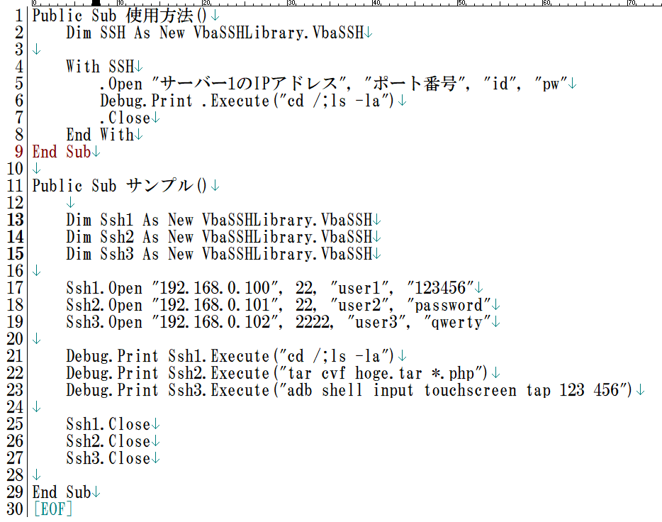
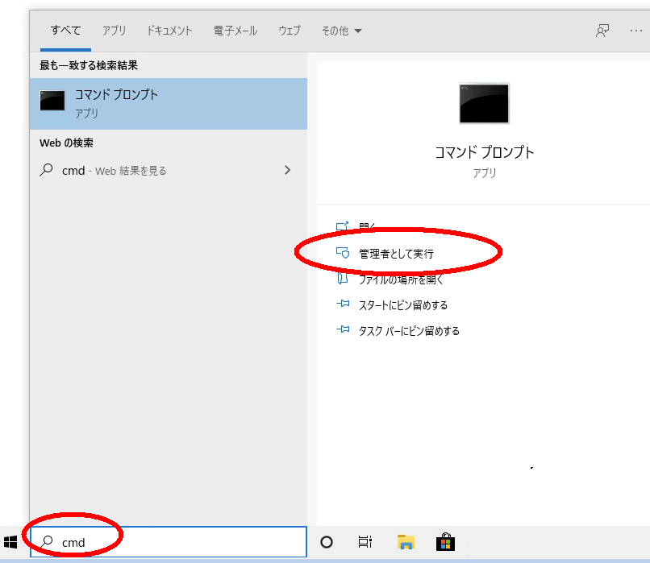
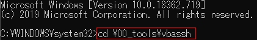
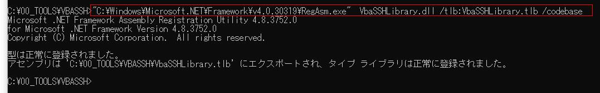
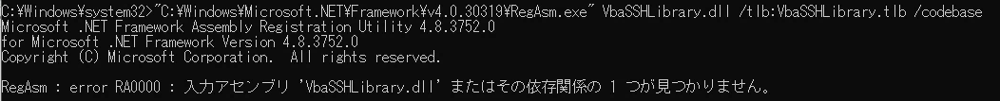
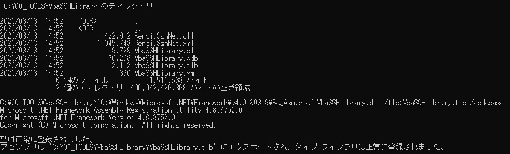
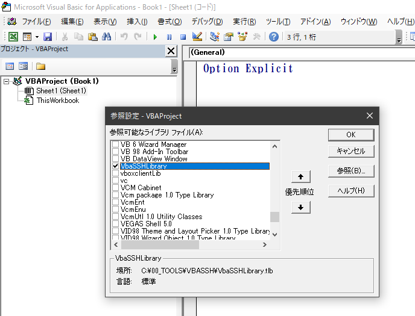

# VbaSSHLibrary（VBASSH）

[](https://github.com/kuwa2005/VBASSH/actions/workflows/build.yml)

Excel（VBA）や VBScript から SSH 接続を行うための **COM コンポーネント**です。`VbaSSH` インスタンスに対して **`Open`（接続）→ `Execute`（コマンド実行）→ `Close`（切断）** の順で呼び出します。



## 要件

- Windows
- .NET Framework 4.8 以降（Windows 10 / 11 では多くの環境で既に入っているか、Windows Update で提供されます）
- Visual Studio 2026（内部バージョン 18）Community など（ソースからビルドする場合）

## ビルド

### Visual Studio から

1. リポジトリをクローンする。
2. `VBASSH.sln` を Visual Studio で開く。
3. NuGet パッケージを復元する（`packages/` は Git 管理外のため、**初回**は Visual Studio の自動復元、または `nuget restore VBASSH.sln` などで `packages` を生成してください）。
4. **Release** または **Debug** でビルドする。  
   生成物は `VBASSH\bin\<構成>\` に出力されます（`VbaSSHLibrary.dll` など）。

**補足:** 構成によっては **ビルド時に COM 登録（`RegisterForComInterop`）** が走ります。レジストリ書き込みで失敗する場合は、Visual Studio を**管理者として**起動するか、下記コマンドライン手順のように **`RegisterForComInterop=false`** でビルドし、登録は **RegAsm を別途**行ってください。

### コマンドライン（vcvars64 + MSBuild）

本リポジトリでは、ビルド環境の一例として次の **x64 用 vcvars** を使ってから MSBuild を起動します（インストール先が異なる場合はパスを読み替えてください）。

```bat
call "C:\Program Files\Microsoft Visual Studio\18\Community\VC\Auxiliary\Build\vcvars64.bat"
"C:\Program Files\Microsoft Visual Studio\18\Community\MSBuild\Current\Bin\MSBuild.exe" VBASSH.sln /t:Restore,Build /p:Configuration=Release /p:Platform="Any CPU" /p:RegisterForComInterop=false
```

リポジトリ直下で実行するか、同等の内容を **`scripts\build-release.cmd`** から実行できます（上記 `vcvars64.bat` のパスはスクリプト内に記載済み）。

`vcvars64.bat` のあと環境変数 `Platform` が **x64** になることがあり、ソリューションに無い `Release|x64` が選ばれて失敗します。その場合は **`/p:Platform="Any CPU"`** を付けてください（スクリプトでは指定済み）。

## COM としての登録（RegAsm）

ActiveX 形式のため、利用前に **`RegAsm.exe`** で登録します。管理者権限のコマンドプロンプトで、**`VbaSSHLibrary.dll` があるディレクトリ**に移動してから実行してください。



作業ディレクトリの例:

```bat
cd C:\path\to\VbaSSHLibrary
```



登録コマンドの例（32 ビットの .NET Framework 4.x）:

```bat
"C:\Windows\Microsoft.NET\Framework\v4.0.30319\RegAsm.exe" VbaSSHLibrary.dll /tlb:VbaSSHLibrary.tlb /codebase
```



64 ビット用の RegAsm が必要な場合は `Framework64` 配下を使います。ビルド構成（AnyCPU / x64 など）に合わせて選んでください。

.NET Framework が未導入の場合は [ダウンロード .NET Framework 4.8](https://dotnet.microsoft.com/ja-jp/download/dotnet-framework/net48) からランタイムを入手してください。

### `RegAsm : error RA0000 : 入力アセンブリ 'VbaSSHLibrary.dll' またはその依存関係の 1 つが見つかりません。`

`VbaSSHLibrary.dll` と**同じフォルダ**に、ビルド出力（`bin\Release`）に並んでいる **すべての依存 `*.dll`**（`Renci.SshNet.dll`、`BouncyCastle.Cryptography.dll`、`Microsoft.Extensions.*.dll`、`System.*.dll` など）を置いてください。**カレントディレクトリ**がそのフォルダかも併せて確認してください。





## Excel VBA での参照設定

VBE で **ツール → 参照** を開き、`VbaSSHLibrary.tlb` を追加し、**VbaSSHLibrary** にチェックが付いていることを確認します。



## API の使い方（例）

```vb
Public Sub Example()
    Dim ssh As New VbaSSHLibrary.VbaSSH
    ssh.Open "192.168.0.10", 22, "user", "password"
    Debug.Print ssh.Execute("uname -a")
    ssh.Close
End Sub
```

複数接続の例:

```vb
Public Sub MultipleSessions()
    Dim s1 As New VbaSSHLibrary.VbaSSH
    Dim s2 As New VbaSSHLibrary.VbaSSH

    s1.Open "192.168.0.100", 22, "user1", "pass1"
    s2.Open "192.168.0.101", 22, "user2", "pass2"

    Debug.Print s1.Execute("cd /; ls -la")
    Debug.Print s2.Execute("tar cvf backup.tar *.php")

    s1.Close
    s2.Close
End Sub
```

`Open` の第 2 引数は **ポート番号（整数）** です。

## `Execute` が期待どおり動かないとき

手動の SSH クライアントでは成功するが、本ライブラリ経由では失敗する場合は、リモートの **ログインシェル・環境変数・非対話実行の制限**などが原因になることがあります。

## 技術スタック

- Visual Basic .NET（.NET Framework 4.8）
- [SSH.NET](https://github.com/sshnet/SSH.NET) **2025.1.0**（`Renci.SshNet`）および同梱の暗号・ログ用依存 DLL

## Windows SmartScreen 対策（予防）

SmartScreen は **未署名**や **ダウンロード元の評判が低い**ファイルを止めやすいです。次の組み合わせが現実的です。

1. **Authenticode で `VbaSSHLibrary.dll`（および配布 ZIP 内の各 EXE/DLL）に署名する**  
   商用の **コード署名証明書**（DigiCert、Sectigo 等）を取得し、Windows SDK の **`signtool`** で署名します。**強名（`.snk`）だけでは SmartScreen は満足しません**（別物です）。

2. **タイムスタンプを付ける**  
   証明書の有効期限が切れたあとも署名を検証できるよう、`signtool` に **RFC3161 タイムスタンプ**（例: DigiCert の `http://timestamp.digicert.com`）を指定します。

3. **EV コード署名証明書（任意）**  
   標準の OV に比べ、SmartScreen の **即時信頼**が得られやすいと言われます（コスト・発行審査は重い）。

4. **リリース時にハッシュを公開する**  
   利用者が改ざんなく取得できたか確認できるよう、GitHub Releases の本文に **SHA256** を記載します。ビルド後に `scripts\compute-release-hashes.cmd` を実行すると一覧を出せます。

5. **Microsoft への申請（補助）**  
   誤検知が続く場合は、[Microsoft の該当フォーム](https://www.microsoft.com/wdsi/filesubmission) などからファイル提出・誤検知報告を検討します（根本対策は署名と継続配布による評判です）。

テンプレート: `scripts\sign-authenticode.example.cmd` をコピーし、PFX パスと `signtool` のパスを環境に合わせて編集してください（**秘密はリポジトリに含めない**こと）。

## コントリビューション・改造前の確認

- **[CONTRIBUTING.md](CONTRIBUTING.md)** … PR の進め方、**COM / VBA 互換**、破壊的変更の扱い、強名キーの注意
- **[docs/QA-CHECKLIST.md](docs/QA-CHECKLIST.md)** … リリース前の手動 QA 手順

## ドキュメント用画像

README 用の画面キャプチャは `docs/images/` に置いています。
